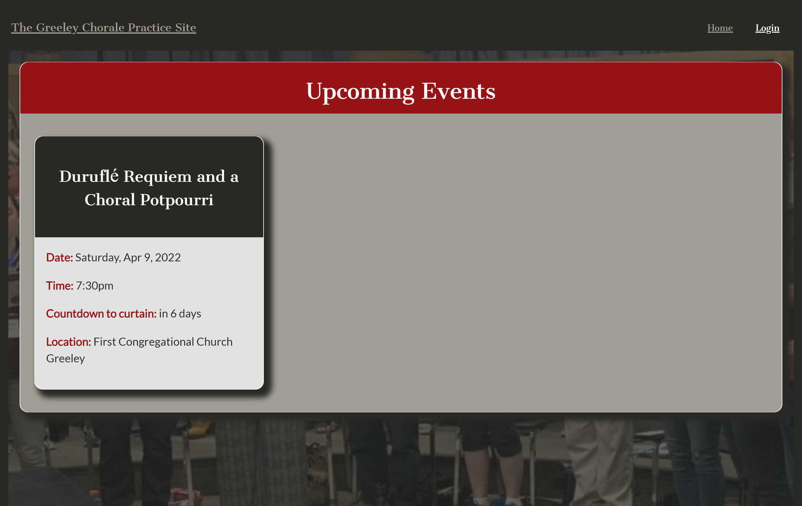
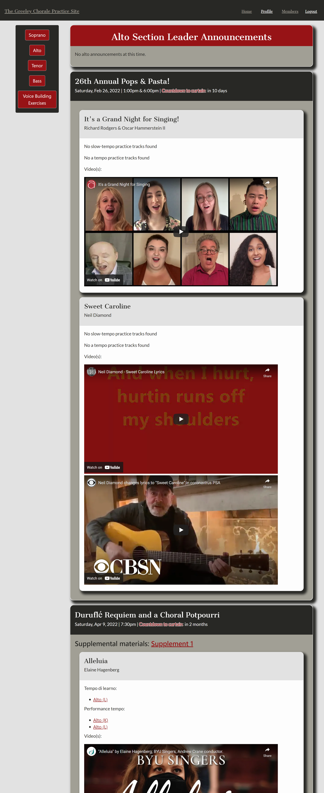

# Greeley Chorale Practice Materials

## Table of Contents

* [Description](#description)
* [Links](#links)
* [Screenshots](#screenshots)
* [Installation Instructions](#installation-instructions)
* [Usage](#usage)
* [Technologies Used](#technologies-used)
* [Tests](#tests)
* [Credits](#credits)
* [Contributing](#contributing)
* [Questions](#questions)
* [Badges](#badges)

## Description

This application uses React to create a site to house practice materials and notes for the Greeley Chorale. To explore this site as a guest, use the following credentials:
email: guest@guest.com
password: GuestPassword

## Links

[Greeley Chorale Practice Materials Site on Heroku](https://gcpm.herokuapp.com/)

## Screenshots

Landing page:

Login page:

Members page as viewed by the Guest account:

Profile page:

Section page:

New Event form:

Add Repertoire form:

New Member form:

## Installation Instructions

npm i

## Usage

This project is intended to be used to house practice materials for members of the Greeley Chorale for upcoming concerts.

## Technologies Used

         

## Tests

npm run test

## Credits

Video-embed component from [bravemaster619](https://dev.to/bravemaster619) and found [here](https://dev.to/bravemaster619/simplest-way-to-embed-a-youtube-video-in-your-react-app-3bk2)

## Contributing

We believe code is never finished, and welcome your contributions to enhance the application's functionality. Please adhere to the Code of Conduct for the Contributor Covenant, version 2.0, at https://www.contributor-covenant.org/version/2/0/code_of_conduct.html.

## Questions

If you have further questions, you can reach me at lauracole1900@comcast.net. For more of my work, see [my GitHub](https://github.com/LauraCole1900).

## Badges

 